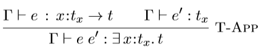

% Mechanizing Refinement Types with Refinement Types
% Michael Humes Borkowski
% March 12, 2021

---

#  Outline 

## Why Refinement Types?

## Prior Work

## Our Work

## Metatheory

## Mechanization

## Future Work

---

# Type Systems with Refinements / Contracts

## Refinement Types \bigskip

 * A set of values that satisfy some arbitrary predicate \bigskip

  

```
      { x:Int | 1 < x && x < 20 }
``` 
\bigskip

 * Refinements can be  program terms or special syntax

 * Type checking can be: static only or hybrid (runtime too)

---

# Why Refinement Types? \bigskip

 *  Functions can express precise preconditions/postconditions \bigskip

 *  This can reduce runtime/uncaught errors \bigskip

 *  Divide by zero \bigskip

 *  Array bounds \bigskip

 *  We can express invariants in the definition of data types

---

# Refinement Types

 * Our present focus: compile-time contract checking only

 * Example: Liquid Haskell

---

#  Big Question: 

## Can we put the type system of Liquid Haskell on a more solid theoretical footing?

	
---

#  First Question: 

## Do refinement type systems work?

## How do we know?

## What can we prove mathematically?
	
---

#  First Question:

## What would we prove mathematically?

 * **Goal: Soundness of the Type System**

 * Type-checked terms don't get stuck
 
 * Types preserved during evaluation

---

#  First Question:

## What would we prove mathematically?

 > * **Goal: Soundness of the Type System**

 > * Can we prove this for Liquid Haskell?

---

#  First Question:

## What would we prove mathematically?

 > * **Goal: Soundness of the Type System**

 > * Can we prove this for Liquid Haskell? **Not yet**

---

# Big Question: 

## Can we put the type system of Liquid Haskell on a more solid theoretical footing? \bigskip
	
 * Existing calculi: not rich enough to model LH's type system

 * Jhala and Vazou have defined a calculus Sprite
 
 * \qquad but no metahtheory (yet) 

---

# Big Question: 

## Can we put the type system of Liquid Haskell on a more solid theoretical footing? \bigskip
	
**Problem: Length and complexity of the metatheory dramatically increases** \bigskip 

 * Are there any missed cases in inductive proofs? 

 * Is there circular reasoning? (does mutual structual induction terminate?)

---

# Big Question: 

## Toy languages to more robust models \bigskip
	
**Problem: Length and complexity of informal metatheory dramatically increases** \bigskip

 *  Idea: A formal _mechanized_ proof checked by an automated theorem prover 

 *  Ideal way to ensure that we can have confidence in our soundness proof.

---

# Prior Work: 
  
##  Metatheory 

##  Mechanization

---

# Prior Metatheory: The Sage Programming Language

 * Knowles, Tomb, Gronski, Freund, Flanagan (2006 Tech Report)

 * Simply-typed Lambda Calculus with Refinement Types, Hybrid Typechecking

 * Full pen-and-paper proofs of progress and preservation 

---

# Prior Metatheory: Refinement Types for Haskell

 * Vazou, Seidel, Jhala, Vytiniotis, Peyton-Jones (2014 Tech Report)

 * Simply-typed Lambda Calculus with refinement types, laziness, data types

 * Metatheory uses denotational semantics for declarative subtyping

 * Full pen-and-paper proofs of progress and preservation

---

# Prior Metatheory: Polymorphic Manifest Contracts

 * Sekiyama, Igarashi, and Greenberg (ToPLaS 2015)

 * Polymorphic Lambda Calculus with manifest contracts

 * No static subtyping rule for refinement types: all checks for contract satisfaction deferred until runtime.

 * Detailed metatheory with a different flavor from Vazou et al

---

# Prior Mechanizations: Formalizing Simple Refinement Types in Coq
 
 * Lehmann and Tanter (CoqPL 2016)

 * Simply-typed Lambda Calculus with Refinements

 * Separate syntax for refinements

 * Refinement subtyping based on axiomatized logic

 * Mechanization in Coq

---

# Prior Mechanizations: System FR

 * Hamza, Voirol, and Kun{\v c}ak (OOPSLA 2019) \bigskip

 * Polymorphic lambda calculus with refinements and more \bigskip

 * No subtyping

 * Metatheory proves semantic soundness

 * Mechanization in Coq: ~20,000 lines, dozens of files

---

# Our Work

## Polymorphic Lambda Calculus with Refinement Types and:

 * Refined Type Variables and Kinds
 
 * Existential Types

 * Arbitrary Expressions as Refinments

---

# Our Work: Mechanization

## Complete Mechanization in Liquid Haskell

 * ~ 23,000 lines of code

 * ~ 14 hours to check

---

#   Why Mechanization?

##  Curry-Howard Correspondence

 * Natural deduction corresponds to the typed lambda calculus

 * Proofs are programs

---

#   Why Mechanization

##  Refinment types ideal for stating/proving propositions

 *  A **theorem** (proposition) is a refinement type

```
        { () | 1 + 1 == 2 }
```

 *  A **proof** is a value of the corresponding type

```
        () :: { () | 1 + 1 == 2 }
```

---

#    Why Mechanization

##  Universal quantifiers decome (dependent) function types

 *  Easily state and prove inductive propositions

```
    prop :: { n:Int | n > 3 } -> { () | 2^n < n! }
```

 *  Haskell techniques help construct a term `prop`

 *  Pattern matching for case splits

 *  The inductive hypothesis is calling `prop (n-1)`

---

#   Metatheory Aspects

##  Main Goal

 *  Progress Theorem

    > If $\varnothing \vdash e : t$ then either $e$ is a value or there exists a term $e'$ such that $e \hookrightarrow$ e'.

 *  Preservation Theorem

    > If $\varnothing \vdash e : t$ and $e \hookrightarrow e'$, then $\varnothing \vdash e' : t$.	

---

#   Metatheory Aspects

##  We use kinds to restrict types that can be refined

 *  Two kinds, base and star, in our language

 *  Only base types can be refined
 
 *  Function types and polymorphic types cannot be

---

#   Metatheory Aspects

##  Why use kinds?

 *  Refining non-base type variables leads to unsoundness

 *  Corresponds to how Liquid Haskell works 

---

#   Metatheory Aspects

##  Refining non-base type variables leads to unsoundness

 *  Example (Jhala and Vazou 2020):

 *  TODO: details? is this just our system?

---

#   Metatheory Aspects

##  Incorporation of Existential Types

 *  Introduced in (Knowles and Flanagan, PLPV 2009)

 *  Affect our rule for term application

    > 

 *  No substitution of arbitrary arguments

---

#   Metatheory Aspects

##  Why Existentials?

 *  No substitution of arbitrary function arguments in `[T-App]`

 *  Can define term substititution only for values

 *  Fits our call-by-value semantics

---

#   Metatheory Aspects

##  Why Existentials?

 *  Trade-off in proof complexity

 *  Benefit: Preservation Lemma, working with `[T-App]` a little easier

 *  Cost: Additional cases for some lemmas

---

#   Metatheory Asects

##  Language Features Increase Proof Complexity

---

#   Mechanization Aspects

##  No Axioms for Refinement Validity

 *  
